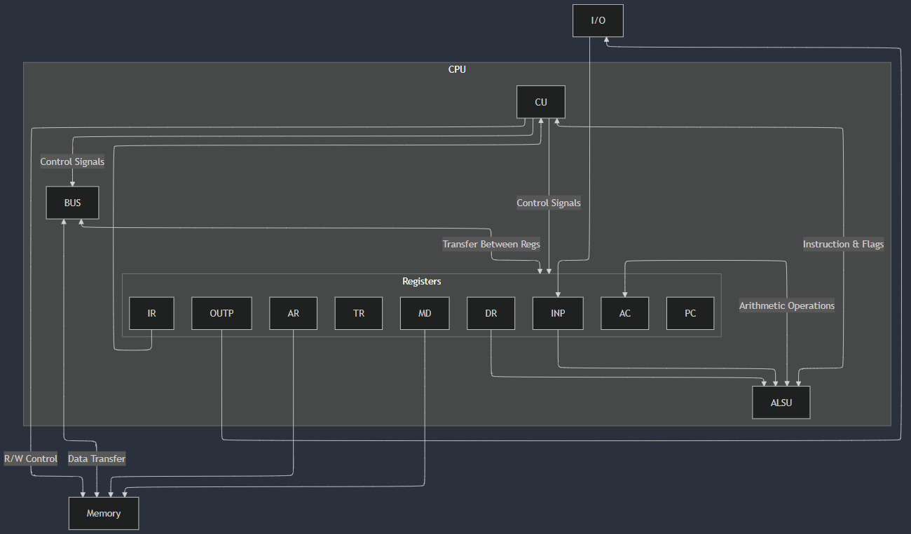

## CPU

### Diagram



### Registers

- `ac` accumulator register
- `ar` address register
- `ir` instruction register
- `dr` data register
- `pc` program counter register
- `tr` temporary register
- `md` memory data register
- `outp` output register

### Flags

- `zf` zero flag: 1 if alsu output is zero else 0
- `sf` sign flag: 1 if alsu output sign bit is 1 else 0

### Instruction Format

| Addressing mode | Opcode | Operand/Address |
| - | - | - |
| 1 bit | 7 bits | 24 bits |

## Assembler

### Instructions

| Instruction | Description                             | Opcode | Param count |
| ----------- | --------------------------------------- | ------ | ----------- |
| and         | logical and                             | 0x00   | 1           |
| or          | logical or                              | 0x01   | 1           |
| inc         | increment operand by 1                  | 0x02   | 1           |
| dec         | decrement operand by 1                  | 0x03   | 1           |
| add         | add operand to ac                       | 0x04   | 1           |
| sub         | subtract ac from operand                | 0x05   | 1           |
| xor         | exclusive or                            | 0x06   | 1           |
| not         | negate operand                          | 0x07   | 1           |
| shr         | logical shift right                     | 0x08   | 1           |
| ashr        | arithmetic shift right                  | 0x09   | 1           |
| ror         | rotate right                            | 0x0A   | 1           |
| rcr         | rotate right through carry              | 0x0B   | 1           |
| shl         | logical shift left                      | 0x0C   | 1           |
| ashl        | arithmatic shift left                   | 0x0D   | 1           |
| rol         | rotate left                             | 0x0E   | 1           |
| rcl         | rotate left through carry               | 0x0F   | 1           |
| wac         | write ac to memory at address operand   | 0x10   | 1           |
| jmp         | unconditional branch to address operand | 0x11   | 1           |
| je          | jmp if zf is 1                          | 0x12   | 1           |
| jne         | jmp if zf is 0                          | 0x13   | 1           |
| jg          | jmp if sf is 0 and zf is 0              | 0x14   | 1           |
| jl          | jmp if sf is 1 and zf is 0              | 0x15   | 1           |
| rac         | read memory at address ac, store at ac  | 0x16   | 0           |
| nop         | no operation                            | 0x79   | 0           |
| iof         | interrupt off                           | 0x7A   | 0           |
| ion         | interrupt on                            | 0x7B   | 0           |
| out         | move ac to outp and set fgo to 0        | 0x7C   | 0           |
| ltr         | load tr with operand                    | 0x7D   | 1           |
| lac         | load ac with operand                    | 0x7E   | 1           |
| hlt         | halt the entire process                 | 0x7F   | 0           |

### Labels

Declaration:

```
$label_name:
    <INSTRUCTION>
```

Usage:

```
    <INSTRUCTION>   $label_name
```

### Addressing mode

- Immediate: using the immediate 24 bit operand
- Direct: reading memory at operand (or dereferencing operand) and using the 32 bit value

Default addressing mode is Immediate.

Adding suffix `i` to any instruction that has parameter count of at least 1 sets its addressing mode to Direct.

e.g.

```
    laci    $address
    // or
    jmpi    $address_of_address
```

### Value types

- Immediate:
  - `0d<number>` decimal number, e.g. `0d1234`
  - `0x<number>` hexadecimal number, e.g. `0dF89E`
- Direct:
  - `[0d<number>]` e.g. `[0d8943]`
  - `[0x<number>]` e.g. `[0xF9AE]`

### Directives

- `.zero` 32 bit `0`, used as a default value
- `.data` start of a data segment which accepts direct value type or strings, e.g. `.data "hello"` or `.data 0d99`

